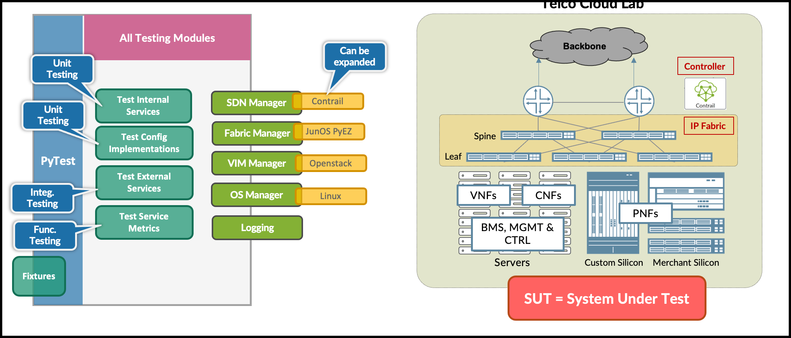
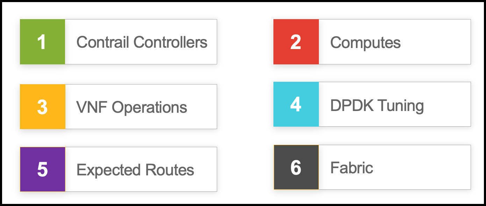
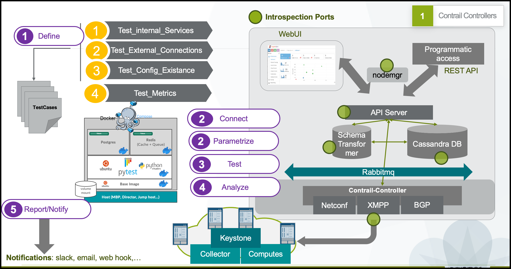
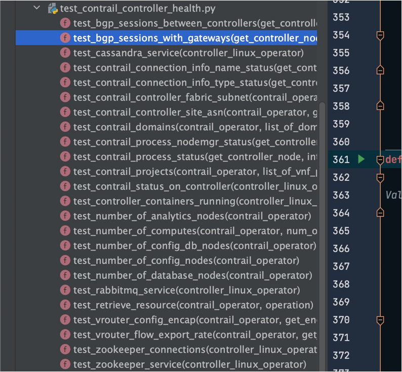
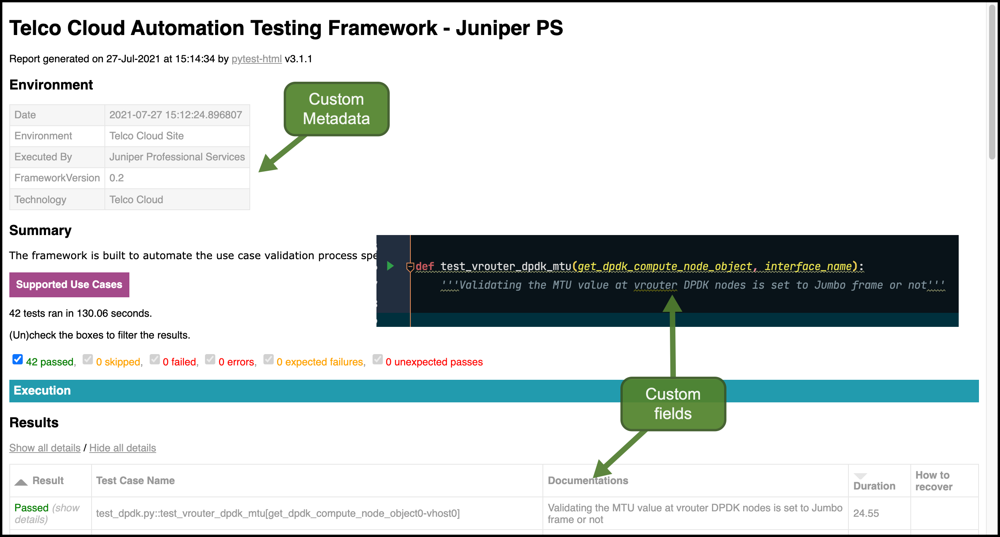
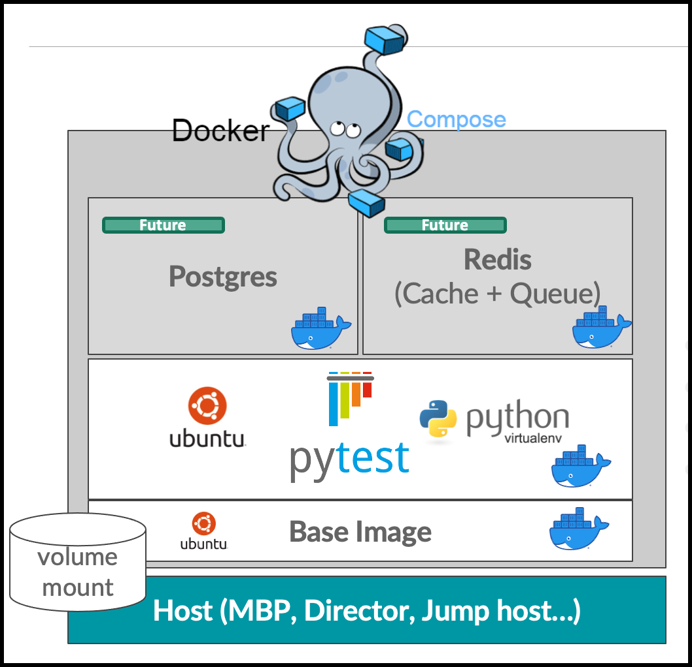

# Telco Cloud Automation Testing Framework

## Introduction

The framework is built to automate different Contrail use cases validation process specifically in telco cloud infrastructure!

The core component here is [PyTest](https://docs.pytest.org/) which is used along with different libraries (such as [JunOS PyEZ](https://github.com/Juniper/py-junos-eznc), Contrail [VNC API](https://www.juniper.net/documentation/en_US/contrail19/information-products/pathway-pages/api-guide-1908/), [Openstack official clients](https://wiki.openstack.org/wiki/OpenStackClients).. etc) in order to connect to the `SUT` = `System Under Test` and execute different type of testing


## Architecture



Each testing module can consist of different types of testing (such as `unit testing`, `integration testing`, `functional testing`...etc). The plugins are installed within managers to create extensible testing framework and allow adding other vendor such as Apstra, Openshift, Cisco ACI..etc

## Supported Use cases

There're currently 6 Catagories supported (& will be expanded accordingly) for checking the health of contrail implementations in the environment




### Contrail Controllers Health Check

| Use case description                                         | Type of Testing                            |
| ------------------------------------------------------------ | ------------------------------------------ |
| Validating if we could retrieve resources from the [3] contrail controllers individually | Unit Testing, Smoke Testing                |
| Validating if number of computes returned from each of the [3] contrail controllers are matched with expected state | Unit Testing, Smoke Testing                |
| Validating if number of config,database,analytics,config database nodes returned from each of the [3] contrail controllers are matched with expected state | Unit Testing, Smoke Testing                |
| Validating if the domains & VNF Projects configured at [3] contrail controllers are matched with expected state | Integration  Testing                       |
| Validating if the BGP ASN configured at [3] contrail controllers are matched with expected state | Integration  Testing, Smoke testing        |
| Validating if the tunnel encapsulation orders configured at [3] contrail controllers are matched with expected state | Func. Testing                              |
| Validating different types of process and connection status  | Unit & Integeration Testing, Smoke testing |


### Computes Health Check

| Use case description                                         | Type of Testing             |
| ------------------------------------------------------------ | --------------------------- |
| Validating if any of vrouter nodes are in ghost state        | Unit Testing                |
| Validating if the vrouter agent process & connections are UP and Running | Unit & Integeration Testing |
| Validating different vrouter dropstats counters              | Functional Testing          |
| alidating different vrouter tap counters like max_flows, local_pref, admin_state... | Functional Testing          |
| Validating if all ports created within contrail have bounded to host-id | Functional Testing          |
| Validating different stats in VRF, VM, VN, TAP levels        | Functional Testing          |


### VNF Operations

| Use case Description                                         | Type of Testing     |
| ------------------------------------------------------------ | ------------------- |
| Validating if the BGPaaS client is configured with VMI or not | Functional Testing  |
| Validating if the BGPaaS client VMI has an IP address associated with it | Functional Testing  |
| Validating if the BGPaaS client is establishing the BGP session(s) with controllers | Functional Testing  |
| Validating if all ports created within contrail have assigned IP address | Functional Testing  |
| Validating if all ports created within contrail have bounded to host-id | IFunctional Testing |
| Validating if all ports configured with AAP (Allowed-Address-Pairs) doesn't have any associated MAC address | Functional Testing  |


### DPDK & EPA Platforms

| Use case Description                                         | Type of Testing                   |
| ------------------------------------------------------------ | --------------------------------- |
| Validating the MTU value at vrouter DPDK nodes is set to Jumbo frame | Functional Testing, Smoke Testing |
| Validating the additional args passed to vrouter dpdk container | Unit Testing                      |
| Validating the service and control coremasks configured in vrouter dpdk container | Unit Testing                      |
| Validating the number of forwarding cores (lcores) at dpdk compute | Integration Testing               |
| Validating the dpdk tuning parameters at host OS             | Integration Testing               |


### Routes

| Use case Description                                         | Type of Testing                   |
| ------------------------------------------------------------ | --------------------------------- |
| Validating if routes received by contrail controllers are landed on virtual-network inet.0 table (GRT) with correct attributes (such as next-hops , local-preferences..) | Functional Testing                |
| Validating if contrail controllers routes are landed in the DC Gateways tables | Functional Testing, Smoke Testing |
| Validating specific routes inside the the fabric             | Functional Testing                |


### IP Fabric

| Use case Description                                         | Type of Testing                    |
| ------------------------------------------------------------ | ---------------------------------- |
| Validating the JunOS software version at the DC Gateways & Leafs | Unit Testing                       |
| Validating the MPLS dynamic tunnels status with the compute nodes | Integration Testing, Smoke Testing |
| Validating the BGP session status between DC Gateways and Contrail Controller Nodes | Integration Testing, Smoke Testing |
| Validating the BGP session status (Underlay/Overlay/MPLS/RR) at the DC Gateways & Leafs | Integration Testing, Smoke Testing |
| Validating if the revenue ports are configured with Jumbo frame and UP at leaf switches | Integration Testing, Smoke Testing |


### Use Case Sample: Contrail Controller







## Reporting




## Running Tests

- Create `$filename_site.ini` under `site_config` directory
- Pull the test container image from dockerhub
- Execute one of the below commands depending on test type

```shell
# Test specific module
docker compose run --rm pytest_app -m pytest /tests -k test_contrail_controller_health  -n4 --verbose 

docker compose run --rm pytest_app -m pytest /tests -k test_fabric_health --verbose


# Test specific function
docker compose run --rm pytest_app -m pytest /tests -k test_bgp_neighbor_status_with_controllers 

docker compose run --rm pytest_app -m pytest /tests -k "test_vrouter_health and not test_vrouter_dropstats and not test_vrouter_interfaces_errors"


# Run all tests
docker compose run --rm pytest_app -m pytest /tests 
```


## Container Packaging

Pytest and python are delivered inside a container. The Docker compose is used here since we can later expand the solution and add additional services like DB & Caching backend, Also we need to consider integrating it (Through API) with other EMS tools like [Appformix](https://www.juniper.net/documentation/en_US/appformix/topics/concept/about-appformix.html), [Paragon](https://www.juniper.net/us/en/products/network-automation.html) to create a complete testing story for the telco cloud




## Suggestion and Feedback

[Click here](mailto:babdelmageed@juniper.net) if you have any feedback or suggestions.


